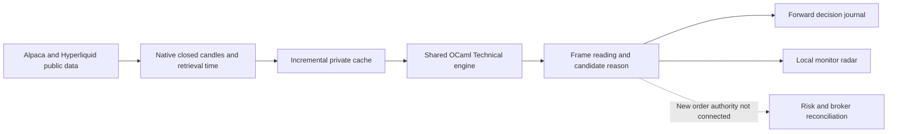

# One multi-market analysis pipeline



`research/market_pipeline.py` fetches native 1m, 5m, 30m, 1h and 4h candles.
The broker's active USD crypto catalog supplies its crypto universe. Listed
equities/ETFs and selected HIP-3 contracts are separate instruments, with their
actual venue and class shown. Dow/Nasdaq ETFs are proxies; HIP-3 currency,
equity and index contracts are perps, not conventional spot currencies,
shares or cash indices.

`bin/analyze_frames_main.ml` calls the shared OCaml `Technical` implementation:
EMA20/50, Wilder RSI14, MACD12/26/9, Bollinger20/2 and the selected Pattern Forge
doji, hammer, shooting-star and engulfing shapes. The high/low comparison uses
the two most recent closed candles. This is a minimal trend-structure reading,
not a complete implementation of Murphy's methods. Full cross-language parity
with Pattern Forge remains unverified.

The geometric confluence policy is explicitly exploratory. It requires a
warmed, current frame with an EMA trend and a matching candle shape. It emits
no winning probability and places no stop. The displayed invalidation level
is that candle's actual low/high, not a calibrated stop distance.

## Timing and gaps

- Only bars whose duration has ended enter the engine. Invalid OHLCV,
  unexpected symbols/intervals and nonadvancing pagination are rejected.
- Native longer bars do not require every 1m WebSocket message to have arrived.
  This is provider historical aggregation retrieved now, not as-received replay.
- Missing scheduled bars reset all indicators. Equity closures bridge only
  adjacent slots in Alpaca's returned session calendar; holidays and early
  closes are not guessed from a weekday rule.
- Every first-observed frame decision is appended before its timestamp is
  marked emitted. Later historical revisions do not rewrite the old decision.
- Slow frames are cached until their next interval. The first seed may take
  longer than a minute; systemd does not run two instances of the one-shot
  service concurrently. Stale rows remain visible rather than fabricating bars.

## Run and inspect on Dublin

```sh
systemctl status ai-ocaml-market-pipeline.timer
journalctl -u ai-ocaml-market-pipeline.service -n 10 --no-pager
sudo .venv/bin/python research/market_pipeline.py
```

The private state directory contains `market-pipeline-cache.json`,
`market-pipeline.json`, `market-frame-decisions.jsonl` and the public REST budget
ledger. The localhost SSH worker carries only the market-analysis snapshot.
The Alpaca key stays on Dublin. This scanner has a GET-only paper-origin
allowlist for catalog/clock/calendar and no order endpoint.

Current execution is still BTC under `quote_cross_30s_v1`. A frame reading is
not a broker order. More analysis does not establish a profitable policy;
paper fills are simulated and can differ from live execution.

Sources: [Alpaca native crypto bars](https://docs.alpaca.markets/us/reference/cryptobars-1),
[Alpaca trading-account market support](https://docs.alpaca.markets/us/docs/account-plans),
[Hyperliquid public API limits](https://hyperliquid.gitbook.io/hyperliquid-docs/for-developers/api/rate-limits-and-user-limits),
[Hyperliquid HIP-3 contracts](https://hyperliquid.gitbook.io/hyperliquid-docs/hyperliquid-improvement-proposals-hips/hip-3-builder-deployed-perpetuals).
