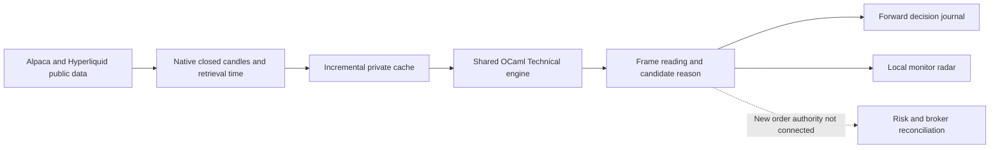

# One multi-market analysis pipeline



`research/market_pipeline.py` fetches native 1m, 5m, 30m, 1h and 4h candles.
The broker's active USD crypto catalog is filtered to the user's BTC/ETH/SOL
allowlist. Its equity catalog validates the 69 requested stocks/ETF before
including them. Listed
equities/ETFs and selected HIP-3 contracts are separate instruments, with their
actual venue and class shown. Dow/Nasdaq ETFs are proxies; HIP-3 currency,
equity and index contracts are perps, not conventional spot currencies,
shares or cash indices.

`bin/analyze_frames_main.ml` calls the shared OCaml `Technical` implementation:
EMA20/50, Wilder RSI14, MACD12/26/9, Bollinger20/2 and the selected Pattern Forge
doji, hammer, shooting-star and engulfing shapes. The high/low comparison uses
the two most recent closed candles. This is a minimal trend-structure reading,
not a complete implementation of Murphy's methods. Full cross-language parity
with Pattern Forge remains unverified.

The geometric confluence policy is explicitly exploratory. It requires a
warmed, current frame with an EMA trend and a matching candle shape. It emits
no winning probability and places no stop. The displayed invalidation level
is that candle's actual low/high, not a calibrated stop distance.

## Timing and gaps

- Only bars whose duration has ended enter the engine. Invalid OHLCV,
  unexpected symbols/intervals and nonadvancing pagination are rejected.
- Native longer bars do not require every 1m WebSocket message to have arrived.
  This is provider historical aggregation retrieved now, not as-received replay.
- Missing scheduled bars reset all indicators. Equity closures bridge only
  adjacent slots in Alpaca's returned session calendar; holidays and early
  closes are not guessed from a weekday rule.
- Every first-observed frame decision is appended before its timestamp is
  marked emitted. Later historical revisions do not rewrite the old decision.
- Slow frames are cached until their next interval. The first seed may take
  longer than a minute; systemd does not run two instances of the one-shot
  service concurrently. Stale rows remain visible rather than fabricating bars.

## Run and inspect on Dublin

```sh
systemctl status ai-ocaml-market-pipeline.timer
journalctl -u ai-ocaml-market-pipeline.service -n 10 --no-pager
sudo .venv/bin/python research/market_pipeline.py
```

The private state directory contains `market-pipeline-cache.json`,
`market-pipeline.json`, `market-frame-decisions.jsonl` and the public REST budget
ledger. The localhost SSH worker carries only the market-analysis snapshot.
The Alpaca key stays on Dublin. This scanner has a GET-only paper-origin
allowlist for catalog/clock/calendar and no order endpoint.

Current automatic entries are still BTC under `quote_cross_30s_v1`. The separate
crypto confluence entry gate is paused; its exits/reconciliation remain active.
The stock scheduler is installed in observation, with no automatic new-order
authority; its tested router and owned-exit path are separate from activation.
A frame reading is
not a broker order. More analysis does not establish a profitable policy;
paper fills are simulated and can differ from live execution.

## Measured scanner work — 5 October

The scanner records monotonic phase durations in `timingsSeconds`: catalog and
session, native history/cache, primary context, OCaml analysis, descriptive
technical analysis, quote requests and durable evidence/cache writing. These
are batch-monitor timings, not exchange-to-order latency. The existing
`processingSeconds` observation precedes final snapshot serialization/write;
phase totals can include subsequent evidence/cache work.

Unchanged frames now avoid repeated identical cache checkpoint writes. Changed
frames still persist before proceeding, allowing initial warmup to resume; the
final journal/emitted checkpoint remains after the append. Old cached data and
raw journals are preserved.

Per-instrument calendar windows retain every expected slot at or after the
first stored candle, including gaps, latest expectations and future sessions.
Empty/out-of-calendar cases preserve the original calendar to prevent the
OCaml 24/7 fallback. This avoids repeating irrelevant old session arrays in
every stock's payload without weakening missing-bar checks.

At 00:47 UTC, one read-only paired run on the same actual cached input produced
**exactly identical complete OCaml plus TA-Lib/Murphy output for 91 instruments
and 455 frames**. Input JSON: 50,002,568 bytes with full calendars versus
9,713,924 bytes with relevant calendars. OCaml runs: 3.5395 / 0.8453 seconds;
descriptive analysis: 5.6430 / 3.6441 seconds. Output SHA-256 for both:
`0ceb0ab2b1c68e3250090fa4cadee5c9c9b4d6b2635bfd5d941397882a553e83`.
These are one run pair, not a latency percentile or controlled production benchmark.

The subsequent actual 00:49 production scan reported 18.4545 seconds, 91
instruments and no retrieval errors. This is a point observation; five-minute,
hourly, bootstrap and rate-budget refreshes can take longer than one minute.
Seven pipeline tests and nine Murphy tests passed on Dublin. No entry policy,
warmup rule, risk gate or calibrated probability was changed.

Sources: [Alpaca native crypto bars](https://docs.alpaca.markets/us/reference/cryptobars-1),
[Alpaca trading-account market support](https://docs.alpaca.markets/us/docs/account-plans),
[Hyperliquid public API limits](https://hyperliquid.gitbook.io/hyperliquid-docs/for-developers/api/rate-limits-and-user-limits),
[Hyperliquid HIP-3 contracts](https://hyperliquid.gitbook.io/hyperliquid-docs/hyperliquid-improvement-proposals-hips/hip-3-builder-deployed-perpetuals).

## Public native HIP-3 primary context

`research/hip3_primary_context.py` collects real native `1d`/`1w` candles via
the existing budgeted public info transport inside the serialized scanner.
It does not construct weekly bars from intraday data or submit orders.
One instrument (two requests) per scan seeds the active catalog gradually;
this cadence and the inherited hourly refresh are **uncalibrated operational
choices**, not a prediction or latency guarantee. Failed attempts move behind
unattempted instruments and preserve successful frames' original receipt times.
Per-frame as-of/receipt/error evidence remains visible.

Actual `xyz:EUR` and `xyz:XYZ100` weekly responses checked on 5 October have
Thursday 00:00 UTC starts and inclusive ends immediately before the next
Thursday. The adapter validates the Unix epoch grid, duration, symbol, interval,
OHLCV, increasing periods and missing-latest/gap conditions. This observed
provider grid differs from Alpaca's Monday weekly boundary. Open bars are
withheld until their actual next native boundary. A changed provider grid
fails validation rather than being silently relabeled.

First production EUR context received at 01:05:28 UTC: 286 consecutive closed
daily bars, but only 41 closed weekly bars. Daily EMA context was descriptive;
weekly EMA50 remained unavailable/warming. JPY at 01:06:15 likewise had 286
daily / 41 weekly bars. Do not claim all 19 HIP-3 primary contexts are seeded
from these first two receipts. Monthly history, full Murphy methodology and
execution/spot-FX adapters remain incomplete; these contracts are perpetuals.

Source: [Hyperliquid native candle API](https://hyperliquid.gitbook.io/hyperliquid-docs/for-developers/api/info-endpoint).
